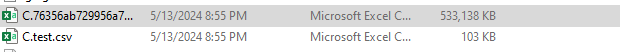
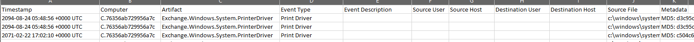
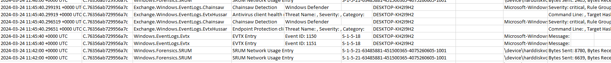
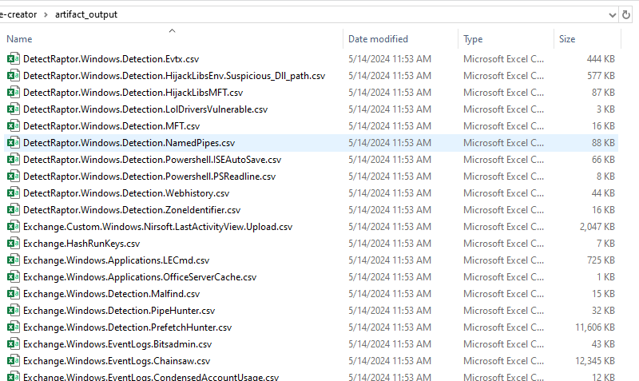

# Velociraptor Timeline Creator

### What?

A command-line tool for dumping data out of Velociraptor data store files into both super-timelines as well as individual artifact CSVs.

### Why?

It's often useful to use Velociraptor (either online or offline) as a tool for collecting data, than to use said data through more traditional tooling such as Excel, Timeline Explorer, Timesketch, Splunk, Elastic, etc.

While Velociraptor does support certain integrations, I found it easier to work with the data by mass-extracting it from individual JSON files into CSV - hence, VTC.

### Use-Cases
* Building a summarized super-timeline from any supported artifacts present in Velociraptor (per-client)
  * ```velo-timeline-creator.exe -velodir "C:\velodatastore"```
  * ```velo-timeline-creator.exe -velodir "C:\velodatastore" -mftlight```
  * ```velo-timeline-creator.exe -velodir "C:\velodatastore" -mftfull```
* Dumping out all supported artifacts across all clients to individual CSV files
  * ```velo-timeline-creator.exe -velodir "C:\velodatastore" -artifactdump```
  * ```velo-timeline-creator.exe -velodir "C:\velodatastore" -artifactdump -mftlight```
  * ```velo-timeline-creator.exe -velodir "C:\velodatastore" -artifactdump -mftfull```

### MFT 
Since MFT can be a very 'heavy' artifact, we exclude related artifacts by default and only parse these when -mftlight or -mftfull is enabled at the command-line.

-mftfull parses the entire artifact without any exclusions.
-mftlight only includes files that have 'interesting' extensions in the output

https://github.com/joeavanzato/velociraptor-timeline-creator/blob/e913633718b3eda690090dd79c4fcd4416b67b85/vars/globalVars.go#L35


### My XYZ artifact is not supported in the super-timeline?
* If you have an artifact you want to include, open an Issue with the name of the artifact as well as a single event from the resultant JSON (usually from a location like C:\VELODATASTORE\clients\C.*\artifacts\ARTIFACTHERE\SomeFile.JSON)
  * Ideally, you provide me the entire JSON output (sanitized where needed) so I can include it in some parsing tests

Build Link: https://github.com/joeavanzato/velociraptor-timeline-creator/releases/download/pre-release/velo-timeline-creator.zip

### Example Outputs

<h4 align="center">Per-Client Super-Timeline Output Examples (Named after ClientID)</h4>
<p align="center">

</p>
<h4 align="center">Super-Timeline Column Format</h4>
<p align="center">

</p>
<h4 align="center">Cross-Artifact Super-Timeline Record Examples</h4>
<p align="center">

</p>
<h4 align="center">Cross-Client Artifact Dump Examples</h4>
<p align="center">

</p>

### What artifacts have native parsers?

Anything not included below will **not** appear in the super-timeline but will appear in an artifact dump using the generic parser.
 
| Artifact   Name                                       | Super Timeline Support | Time Field                             |
|-------------------------------------------------------|------------------------|----------------------------------------|
| DetectRaptor.Generic.Detection.WebshellYara           | Yes                    | Ctime                                  |
| DetectRaptor.Windows.Detection.Amcache                | Yes                    | KeyMTime                               |
| DetectRaptor.Windows.Detection.Applications           | Yes                    | KeyLastWriteTimestamp                  |
| DetectRaptor.Windows.Detection.BinaryRename           | Yes                    | Mtime                                  |
| DetectRaptor.Windows.Detection.Evtx                   | Yes                    | EventTime                              |
| DetectRaptor.Windows.Detection.HijackLibsEnv          | Yes                    | TimestampsSI.LastModified0X10          |
| DetectRaptor.Windows.Detection.HijackLibsMFT          | Yes                    | TimestampsSI.LastModified0X10          |
| DetectRaptor.Windows.Detection.LolDriversVulnerable   | Yes                    | KeyMTime                               |
| DetectRaptor.Windows.Detection.MFT                    | Yes                    | SI_Created                             |
| DetectRaptor.Windows.Detection.NamedPipes             | Yes                    | EventTime                              |
| DetectRaptor.Windows.Detection.Powershell.ISEAutoSave | Yes                    | FileInfo.Mtime                         |
| DetectRaptor.Windows.Detection.Powershell.PSReadline  | Yes                    | FileInfo.Mtime                         |
| DetectRaptor.Windows.Detection.Webhistory             | Yes                    | VisitTime                              |
| DetectRaptor.Windows.Detection.ZoneIdentifier         | Yes                    | HostTimestampsSI.Mtime                 |
| Exchange.Custom.Windows.Nirsoft.LastActivityView      | Yes                    | ActionTime                             |
| Exchange.HashRunKeys                                  | No                     |                                        |
| Exchange.Windows.Applications.DefenderDHParser        | Yes                    | Detection.ThreatTrackingStartTime      |
| Exchange.Windows.Applications.LECmd                   | Yes                    | SourceCreated                          |
| Exchange.Windows.Applications.OfficeServerCache       | Yes                    | Modified                               |
| Exchange.Windows.Detection.Malfind                    | Yes                    | CreateTime                             |
| Exchange.Windows.Detection.PipeHunter                 | No                     |                                        |
| Exchange.Windows.Detection.PrefetchHunter             | Yes                    | CreationTime                           |
| Exchange.Windows.EventLogs.Bitsadmin                  | Yes                    | EventTime                              |
| Exchange.Windows.EventLogs.Chainsaw                   | Yes                    | EventTime                              |
| Exchange.Windows.EventLogs.CondensedAccountUsage      | Yes                    | EventTime                              |
| Exchange.Windows.EventLogs.EvtxHussar                 | Yes                    | EventTime                              |
| Exchange.Windows.EventLogs.Hayabusa                   | Yes                    | Timestamp                              |
| Exchange.Windows.EventLogs.LogonSessions              | Yes                    | Start                                  |
| Exchange.Windows.EventLogs.RDPClientActivity          | Yes                    | Start                                  |
| Exchange.Windows.Forensics.Clipboard                  | Yes                    | CreatedTime                            |
| Exchange.Windows.Forensics.FileZilla                  | No                     |                                        |
| Exchange.Windows.Forensics.Jumplists_JLECmd           | Yes                    | SourceCreated                          |
| Exchange.Windows.Forensics.PersistenceSniper          | No                     |                                        |
| Exchange.Windows.Forensics.ThumbCache                 | No                     |                                        |
| Exchange.Windows.Forensics.Trawler                    | No                     |                                        |
| Exchange.Windows.Forensics.UEFI                       | Yes                    | Mtime                                  |
| Exchange.Windows.Forensics.UEFI.BootApplication       | Yes                    | Ctime                                  |
| Exchange.Windows.Memory.InjectedThreadEx              | Yes                    | ThreadStartTime                        |
| Exchange.Windows.NTFS.Timestomp                       | Yes                    | CreatedTimestamps.Created0X10          |
| Exchange.Windows.Office.MRU                           | Yes                    | Timestamp                              |
| Exchange.Windows.Registry.BackupRestore               | Yes                    | ModTime                                |
| Exchange.Windows.Registry.CapabilityAccessManager     | Yes                    | LastUsedTimeStart                      |
| Exchange.Windows.Registry.COMAutoApprovalList         | Yes                    | Mtime                                  |
| Exchange.Windows.Registry.Domain                      | Yes                    | ModTime                                |
| Exchange.Windows.Registry.NetshHelperDLLs             | Yes                    | Modified                               |
| Exchange.Windows.Registry.ScheduledTasks              | Yes                    | Mtime                                  |
| Exchange.Windows.Sys.LoggedInUsers                    | Yes                    | StartTimestamp                         |
| Exchange.Windows.System.BinaryVersion                 | Yes                    | SITimestamps.Created0X10               |
| Exchange.Windows.System.Powershell.ISEAutoSave        | Yes                    | Mtime                                  |
| Exchange.Windows.System.PrinterDriver                 | Yes                    | PE.FileHeader.TimeDateStamp            |
| Exchange.Windows.System.WindowsErrorReporting         | Yes                    | Timestamp                              |
| Exchange.Windows.System.WMIProviders                  | No                     |                                        |
| Exchange.Windows.Timeline.Prefetch.Improved           | Yes                    | EventTime                              |
| Generic.Applications.Chrome.SessionStorage            | No                     |                                        |
| Generic.Applications.Office.Keywords                  | Yes                    | OfficeMtime                            |
| Generic.Client.DiskSpace                              | No                     |                                        |
| Generic.Client.DiskUsage                              | No                     |                                        |
| Generic.Client.Info                                   | Some                   | LastLogin                              |
| Generic.Detection.Yara.Zip                            | Yes                    | Mtime                                  |
| Generic.Forensic.SQLiteHunter                         | Most                   | Mixed Fields - LastAccess/Visit Mostly |
| Generic.Forensic.Timeline                             | Yes                    | Mtime                                  |
| Generic.Network.InterfaceAddresses                    | No                     |                                        |
| Generic.System.ProcessSiblings                        | Yes                    | StartTime                              |
| Generic.System.Pstree                                 | Yes                    | StartTime                              |
| Network.ExternalIpAddress                             | No                     |                                        |
| Windows.Analysis.EvidenceOfDownload                   | Yes                    | Mtime                                  |
| Windows.Analysis.EvidenceOfExecution                  | Yes                    |                                        |
| Windows.Applications.ChocolateyPackages               | No                     |                                        |
| Windows.Applications.Chrome.Extensions                | No                     |                                        |
| Windows.Applications.Chrome.History                   | Yes                    | VisitTime                              |
| Windows.Applications.Edge.History                     | Yes                    | VisitTime                              |
| Windows.Applications.Firefox.Downloads                | Yes                    | StartTime                              |
| Windows.Applications.Firefox.History                  | Yes                    | VisitTime                              |
| Windows.Applications.NirsoftBrowserViewer             | Yes                    | Visited                                |
| Windows.Applications.OfficeMacros                     | No                     |                                        |
| Windows.Carving.USN                                   | Yes                    | TimeStamp                              |
| Windows.Detection.Amcache                             | Yes                    | KeyMTime                               |
| Windows.Detection.BinaryHunter                        | Yes                    | File.Timestamps.Mtime                  |
| Windows.Detection.EnvironmentVariables                | No                     |                                        |
| Windows.Detection.ForwardedImports                    | No                     |                                        |
| Windows.Detection.Impersonation                       | No                     |                                        |
| Windows.Detection.Mutants                             | No                     |                                        |
| Windows.EventLogs.AlternateLogon                      | Yes                    | EventTime                              |
| Windows.EventLogs.Evtx                                | Yes                    | TimeCreated                            |
| Windows.EventLogs.Modifications                       | Yes                    | Mtime                                  |
| Windows.EventLogs.PowershellModule                    | Yes                    | EventTime                              |
| Windows.EventLogs.PowershellScriptblock               | Yes                    | EventTime                              |
| Windows.EventLogs.RDPAuth                             | Yes                    | EventTime                              |
| Windows.Forensics.Bam                                 | Yes                    | BamTime                                |
| Windows.Forensics.CertUtil                            | Yes                    | DownloadTime                           |
| Windows.Forensics.Lnk                                 | Yes                    | SourceFile.Mtime                       |
| Windows.Forensics.PartitionTable                      | No                     |                                        |
| Windows.Forensics.RDPCache                            | Yes                    | Atime                                  |
| Windows.Forensics.RecycleBin                          | Yes                    | DeletedTimestamp                       |
| Windows.Forensics.SAM                                 | Yes                    | CreatedTime, ParsedF.LastLoginDate     |
| Windows.Forensics.Shellbags                           | Yes                    | Parsed.ShellBag.Extension.LastAccessed |
| Windows.Forensics.SRUM                                | Yes                    | TimeStamp                              |
| Windows.Forensics.Timeline                            | Yes                    | LastExecutionTS                        |
| Windows.Forensics.Usn                                 | Yes                    | Timestamp                              |
| Windows.KapeFiles.Targets                             | Yes                    | Created                                |
| Windows.Memory.ProcessInfo                            | No                     |                                        |
| Windows.Network.ArpCache                              | No                     |                                        |
| Windows.Network.ListeningPorts                        | No                     |                                        |
| Windows.Network.Netstat                               | Yes                    | Timestamp                              |
| Windows.Network.NetstatEnriched                       | Yes                    | Timestamp                              |
| Windows.NTFS.MFT                                      | Yes                    | Created0X10                            |
| Windows.Persistence.PermanentWMIEvents                | No                     |                                        |
| Windows.Registry.AppCompatCache                       | Yes                    | ModificationTime                       |
| Windows.Registry.NTUser                               | Yes                    | Mtime                                  |
| Windows.Registry.PuttyHostKeys                        | Yes                    | Mtime                                  |
| Windows.Registry.RDP                                  | Yes                    | LastWriteTime                          |
| Windows.Registry.RecentDocs                           | Yes                    | LastWriteTime                          |
| Windows.Registry.Sysinternals.Eulacheck               | Yes                    | TimeAccepted                           |
| Windows.Registry.UserAssist                           | Yes                    | LastExecution                          |
| Windows.Registry.WDigest                              | Yes                    | LastModified                           |
| Windows.Sys.AllUsers                                  | No                     |                                        |
| Windows.Sys.CertificateAuthorities                    | No                     |                                        |
| Windows.Sys.DiskInfo                                  | No                     |                                        |
| Windows.Sys.Drivers                                   | Yes                    | DriverDate, InstallDate                |
| Windows.Sys.FirewallRules                             | No                     |                                        |
| Windows.Sys.Interfaces                                | No                     |                                        |
| Windows.Sys.PhysicalMemoryRanges                      | No                     |                                        |
| Windows.Sys.Programs                                  | Yes                    | KeyLastWriteTimestamp                  |
| Windows.Sys.StartupItems                              | No                     |                                        |
| Windows.Sys.Users                                     | Yes                    | HomedirMtime                           |
| Windows.Sysinternals.Autoruns                         | Yes                    | Time                                   |
| Windows.System.Amcache                                | Yes                    | LastModified, KeyMTime                 |
| Windows.System.AuditPolicy                            | No                     |                                        |
| Windows.System.CatFiles                               | No                     |                                        |
| Windows.System.DLLs                                   | No                     |                                        |
| Windows.System.DNSCache                               | No                     |                                        |
| Windows.System.Handles                                | No                     |                                        |
| Windows.System.HostsFile                              | No                     |                                        |
| Windows.System.LocalAdmins                            | No                     |                                        |
| Windows.System.Powershell.ModuleAnalysisCache         |                        | Timestamp                              |
| Windows.System.Powershell.PSReadline                  | No                     | ?                                      |
| Windows.System.Pslist                                 | No                     |                                        |
| Windows.System.RootCAStore                            | Yes                    | ModTime                                |
| Windows.System.Services                               | Yes                    | Created                                |
| Windows.System.Shares                                 | No                     | ?                                      |
| Windows.System.Signers                                | No                     |                                        |
| Windows.System.TaskScheduler                          | No                     |                                        |
| Windows.Timeline.MFT                                  | Yes                    | EventTime                              |
| Windows.Timeline.Prefetch                             | Yes                    | PrefetchMtime                          |
| Windows.Timeline.Registry.RunMRU                      | Yes                    | RegMtime                               |

